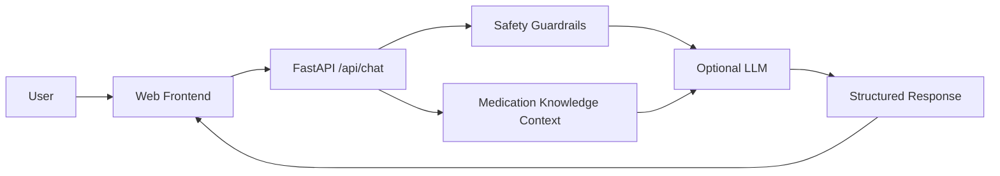

# AI Pharmacy Assistant

A safety-focused medication information assistant built with FastAPI, Python, grounded medication context, and an optional OpenAI LLM layer.

## What it demonstrates

- Healthcare/pharmacy domain modeling
- LLM API integration
- Grounded responses using a curated medication dataset
- Safety guardrails and urgent-symptom detection
- Structured REST API responses
- Automated API tests
- Environment-based configuration
- Docker deployment
- Simple browser frontend

## Architecture



## Features

### Medication grounding
The assistant currently includes a small curated dataset for selected medicines. Responses expose the matching medication and its source context instead of pretending the model has a verified medical database.

### AI layer
When `OPENAI_API_KEY` is configured, the application uses an LLM to turn grounded context into a concise natural-language response. If the API is unavailable, the application falls back to a deterministic local response.

### Safety layer
The API detects several urgent and higher-risk patterns and adds safety guidance. It does not diagnose patients or provide individualized prescribing instructions.

## API

### `GET /health`
Returns service health and whether an LLM key is configured.

### `POST /api/chat`
Request:

```json
{"question":"What is cetirizine used for?"}
```

Response contains:

- `answer`
- `medication`
- `safety`
- `source`
- `provider`

Interactive OpenAPI documentation is available at `/docs` when the server is running.

## Run locally

```bash
python -m venv .venv
source .venv/bin/activate
pip install -r requirements.txt
cp .env.example .env
uvicorn app.main:app --reload
```

On Windows, activate the virtual environment with `.venv\\Scripts\\activate`.

Open `http://localhost:8000` for the frontend or `http://localhost:8000/docs` for the API documentation.

## Environment variables

| Variable | Purpose |
|---|---|
| `OPENAI_API_KEY` | Optional LLM API key |
| `OPENAI_MODEL` | LLM model name |
| `APP_ENV` | Environment name |
| `ALLOWED_ORIGINS` | Comma-separated CORS origins |

Never commit `.env` or API keys.

## Testing

```bash
pytest -q
```

## Deployment

The included `Dockerfile` and `render.yaml` provide a straightforward path to deployment on a container-capable hosting provider. Set `OPENAI_API_KEY` as a secret in the hosting dashboard rather than committing it.

## Medical safety disclaimer

This project is a software portfolio demonstration and an educational information tool. It is **not** a clinical decision-support system, medical device, diagnostic service, or substitute for a qualified healthcare professional. Medication information can change and should be verified against current authoritative labeling and professional guidance before clinical use.

## Future improvements

- Expand the grounded medication catalog with a licensed/authoritative data source
- Add retrieval-augmented generation with source-level citations
- Add authentication and rate limiting for public deployment
- Add conversation history with privacy controls
- Add broader automated safety evaluations
- Add monitoring and structured production logging
