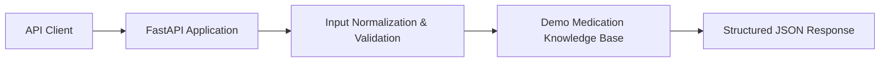

# AI Pharmacy Assistant

A small FastAPI-based medication information API designed as a portfolio project combining pharmacy-domain knowledge with practical backend development.

> **Safety:** This project provides general educational information only. It is not a diagnostic tool, does not prescribe treatment, and is not a substitute for advice from a qualified doctor or pharmacist.

## Features

- REST API built with FastAPI
- Medication lookup for a small demonstration knowledge base
- Structured medication information including generic name, drug class, uses, common side effects, and warnings
- Health-check endpoint
- Input normalization and basic validation
- Clear safety messaging for unknown medicines and every successful lookup
- Restricted CORS methods for the demo API
- Simple, readable Python architecture suitable for extension

## Current medication knowledge base

The demo currently includes:

- Paracetamol
- Ibuprofen
- Cetirizine

This is intentionally a small demonstration dataset. It should **not** be represented as a comprehensive drug database.

## API endpoints

### `GET /`

Returns application metadata and the safety notice.

### `GET /health`

Returns a simple health status.

### `GET /medicine/{medicine_name}`

Returns information for a medicine in the demonstration knowledge base.

Example:

```text
GET /medicine/paracetamol
```

Unknown medicines return a clear `found: false` response rather than inventing information.

## Run locally

Clone the repository and install the dependencies:

```bash
python -m venv .venv
```

Activate the environment on Windows:

```bash
.venv\Scripts\activate
```

Activate it on macOS/Linux:

```bash
source .venv/bin/activate
```

Install dependencies:

```bash
pip install -r requirements.txt
```

Start the API:

```bash
uvicorn app.main:app --reload
```

Then open the FastAPI documentation at `/docs` on the local server.

## Technology stack

- Python
- FastAPI
- Uvicorn
- REST API
- CORS middleware

## Architecture



## Why this project exists

The project explores how a pharmacy-focused application can expose structured medication information through a simple API while keeping safety and transparency in the design.

It demonstrates practical skills in:

- Healthcare-domain problem framing
- Python backend development
- REST API design
- Input validation
- Error handling
- Documentation
- Safety-aware healthcare software design

## Limitations

This is a portfolio/demo project, not a clinically validated system. The medication dataset is intentionally limited and should not be used to make medical decisions.

The current version does not provide clinical decision support, diagnosis, prescription recommendations, or individualized treatment plans.

## Future improvements

Possible next steps include:

- Expand the medication knowledge base using appropriately licensed and reputable data sources
- Add automated tests
- Add a frontend interface
- Add source attribution for medication information
- Add structured interaction checking using a properly licensed dataset
- Add an LLM layer with explicit safety guardrails and grounded responses
- Add deployment configuration and CI checks

## Portfolio note

This repository is intended to demonstrate responsible software development at the intersection of pharmacy knowledge and AI/automation concepts. Claims about medical accuracy or clinical validation should not be inferred from this demonstration project.
