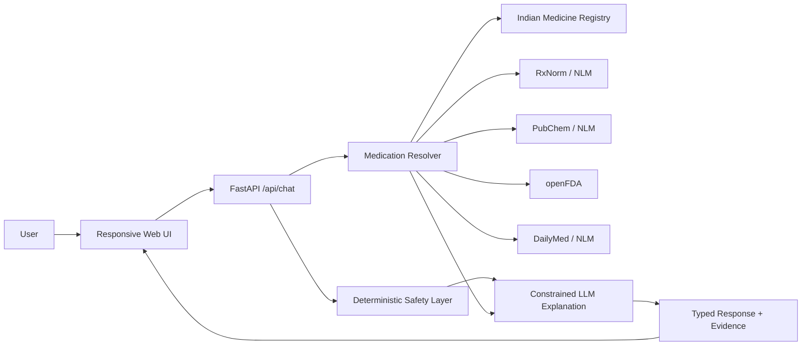

# AI Pharmacy Assistant

A safety-aware medication intelligence web application that resolves medicine identities across Indian brand names and generic names, retrieves evidence from public drug-information services, and produces concise grounded explanations.

## Portfolio summary

**AI Pharmacy Assistant** demonstrates healthcare-domain software engineering across medication entity resolution, retrieval-grounded LLMs, public API integration, deterministic safety guardrails, typed APIs, automated testing, responsive frontend design, and deployment packaging.

## Architecture



## Core capabilities

- Search by **Indian brand name**, generic name, strength, or common typing variants.
- Conservative exact-match handling to avoid silently substituting similar products.
- Dynamic medication identity resolution through the Indian medicine registry, RxNorm/NLM, openFDA, and PubChem/NLM.
- Clinical grounding through DailyMed and openFDA drug-label information.
- Public-source fallback discovery without requiring Google Cloud billing.
- Source URLs returned with results so users can inspect the evidence.
- Deterministic safety handling for urgent or treatment-change requests before an LLM is used.
- LLM explanations constrained to retrieved evidence, with deterministic fallback when the model is unavailable.
- Typed FastAPI request/response schemas with Pydantic validation.
- Responsive, mobile-first frontend with medication identity cards, evidence panels, source badges, loading states, and safety notices.
- Docker and Render deployment configuration.
- Interactive OpenAPI documentation at `/docs`.

## Retrieval strategy

The application does not treat a generic web result as medical truth. It separates **identity resolution** from **clinical grounding**:

1. Normalize the user's medication query.
2. Check verified/local Indian product data.
3. Resolve generic concepts through RxNorm/NLM.
4. Use PubChem/NLM for additional compound identity discovery.
5. Retrieve label evidence from DailyMed/openFDA.
6. If evidence is insufficient, return an explicit uncertainty state rather than inventing a composition or indication.
7. Pass only retrieved context to the explanation layer.

This architecture is intentionally designed so that an obscure or newly encountered medicine does not require manually embedding every possible brand name in application code.

## Safety design

The application is informational and is not a diagnostic or prescribing system. It does not instruct users to start, stop, increase, or decrease prescription treatment. Urgent and treatment-change requests are handled deterministically before the LLM runs. Missing evidence is treated as missing evidence, not as permission to guess.

A production clinical system would require substantially more validation, governance, monitoring, source coverage, privacy controls, clinical review, and regulatory assessment.

## Local development

```bash
python -m venv .venv
source .venv/bin/activate  # Windows: .venv\\Scripts\\activate
pip install -r requirements.txt
cp .env.example .env
uvicorn app.main:app --reload
```

Open `http://127.0.0.1:8000` for the web UI or `http://127.0.0.1:8000/docs` for Swagger UI.

The Groq API key is optional. Without it, deterministic retrieval and safety behavior still work.

## Example request

```bash
curl -X POST http://127.0.0.1:8000/api/chat \\
  -H 'Content-Type: application/json' \\
  -d '{"question":"What are common side effects of ibuprofen?"}'
```

## Testing

```bash
pytest -q
```

Tests cover API behavior, schema validation, safety rules, exact brand/composition normalization, RxNorm confidence rules, openFDA identity matching, and public-source discovery behavior.

## Data sources

- DailyMed / National Library of Medicine: https://dailymed.nlm.nih.gov/
- RxNorm / National Library of Medicine: https://rxnav.nlm.nih.gov/
- PubChem / National Library of Medicine: https://pubchem.ncbi.nlm.nih.gov/
- openFDA drug-label API: https://open.fda.gov/apis/drug/label/
- Indian medicine registry integration: configured through `INDIA_DRUG_DB_URL`

## Deployment

The repository includes a Dockerfile and Render configuration. The application is designed to run without Google Cloud billing. The former Google Agent Search integration is intentionally not required.

## CV-ready description

**AI Pharmacy Assistant | Healthcare AI / Full-Stack Project**

Built a safety-aware medication intelligence application using **FastAPI, Python, Pydantic, asynchronous HTTP retrieval, RxNorm/NLM, PubChem/NLM, DailyMed, openFDA, and an optional Groq-hosted LLM**. Implemented conservative brand/generic entity resolution, evidence-grounded generation, deterministic safety guardrails, typed APIs, automated tests, source attribution, Docker/Render deployment packaging, and a responsive mobile-first frontend. Designed the retrieval pipeline to handle unknown medicine queries without relying on a manually hard-coded finite brand catalog.
