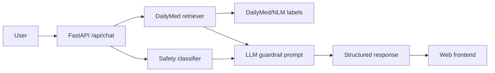

# AI Pharmacy Assistant

A safety-aware AI medication information assistant built with FastAPI, an LLM layer, and live grounding against DailyMed labeling from the U.S. National Library of Medicine.

## Why this project exists

Medication questions are a poor fit for an ungrounded chatbot. This project demonstrates a safer architecture: identify a medication, retrieve authoritative label context, apply deterministic safety rules, then optionally ask an LLM to explain only the supplied evidence.

## Architecture



## Features

- `POST /api/chat` structured chat endpoint
- Deterministic safety classification for urgent and higher-risk queries
- Live DailyMed label retrieval when a medication can be identified
- Source URLs returned with responses
- Optional OpenAI Responses API integration
- Safe deterministic fallback when an LLM key is absent or the model fails
- Pydantic validation and typed API schemas
- Automated API tests
- Minimal browser frontend
- Docker and Render configuration
- Interactive OpenAPI documentation at `/docs`

DailyMed provides current Structured Product Label information through a REST API. The FDA also identifies DailyMed as an official place to search drug labeling. See the project documentation links below.

## Run locally

```bash
python -m venv .venv
source .venv/bin/activate  # Windows: .venv\\Scripts\\activate
pip install -r requirements.txt
cp .env.example .env
uvicorn app.main:app --reload
```

Open `http://127.0.0.1:8000` for the web UI or `http://127.0.0.1:8000/docs` for Swagger UI.

An OpenAI API key is optional. Without one, the application still demonstrates retrieval, safety classification, source grounding, and deterministic fallback behavior.

## Example request

```bash
curl -X POST http://127.0.0.1:8000/api/chat \\
  -H 'Content-Type: application/json' \\
  -d '{"question":"What are common side effects of ibuprofen?"}'
```

## Safety design

The application does not diagnose conditions or provide individualized prescription instructions. It detects selected urgent and higher-risk contexts before the LLM runs. The LLM is explicitly instructed to avoid unsupported claims and to use only retrieved context.

This is a portfolio project, not a medical device or clinically validated decision-support system.

## Testing

```bash
pytest -q
```

The tests cover validation, health checks, urgent-query handling, structured response shape, and grounding behavior using mocked retrieval.

## Deployment

A `render.yaml` and `Dockerfile` are included for deployment. The repository does not claim to be deployed until a live service is actually provisioned and tested.

## Data sources

- DailyMed/NLM: https://dailymed.nlm.nih.gov/
- FDA drug information: https://www.fda.gov/drugs/information-consumers-and-patients-drugs/find-information-about-drug
- FDA drug safety: https://www.fda.gov/drugs/drug-safety-and-availability

## Limitations

The medication identifier is intentionally conservative and the system depends on the availability of DailyMed labeling. A missing source is treated as missing evidence, not as permission for the model to guess. A production clinical system would require substantially more validation, governance, monitoring, source coverage, and regulatory review.

## Portfolio value

This project demonstrates practical skills across healthcare-domain reasoning, LLM integration, retrieval grounding, API design, safety guardrails, testing, documentation, and deployment packaging.
